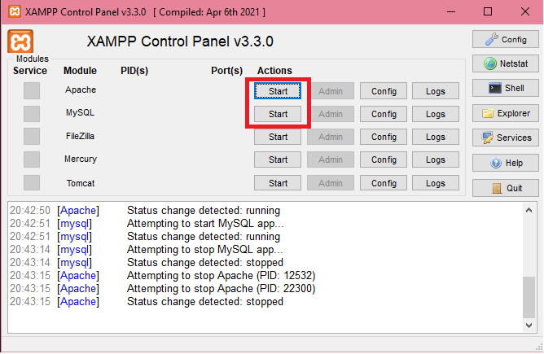
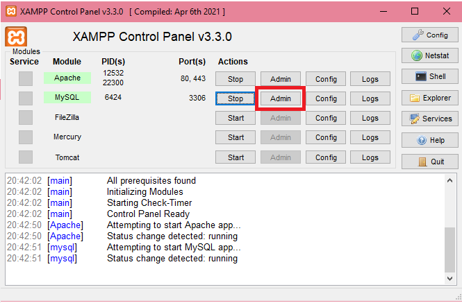
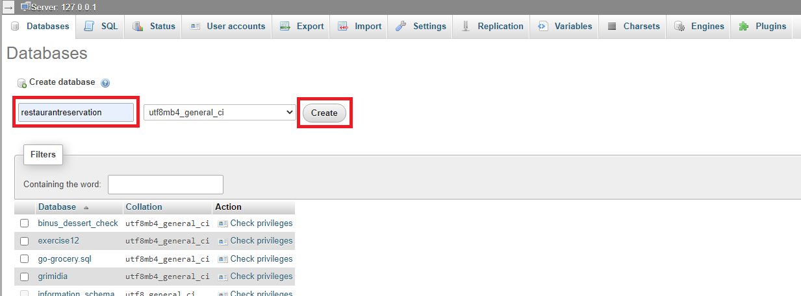
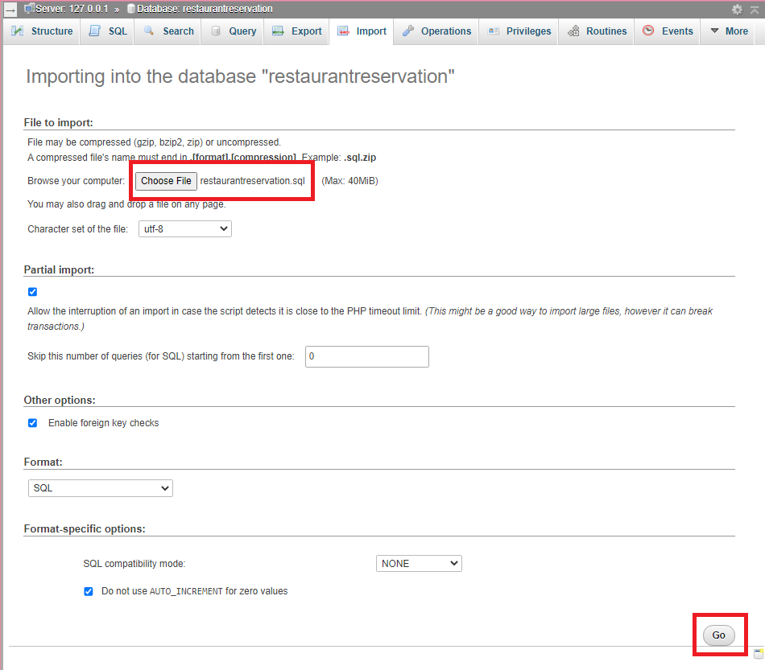
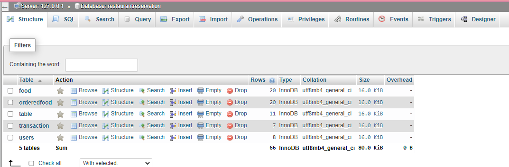
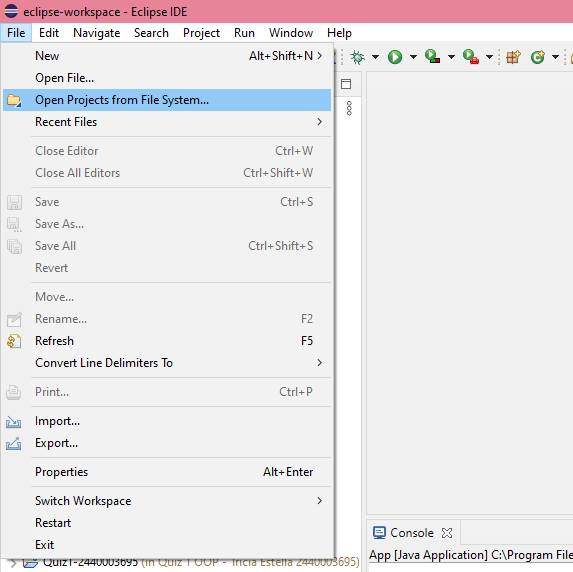
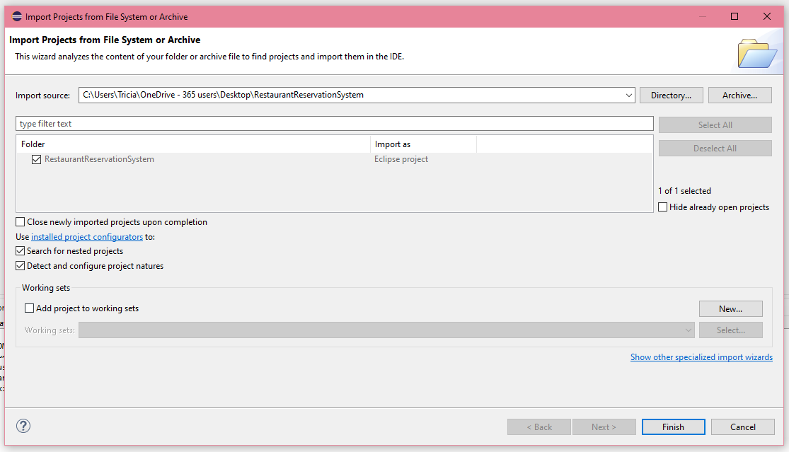
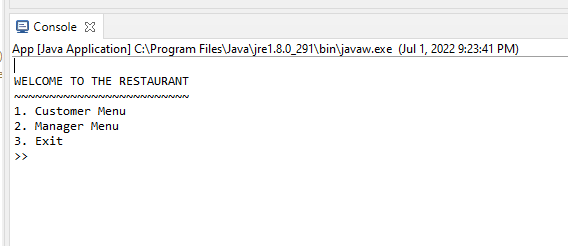
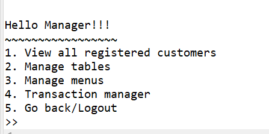
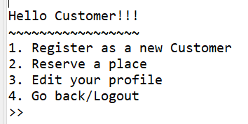

# Restaurant Reservation System

Group 3:

Tricia Estella - 2440003695

Nadzla Andrita Intan Ghayatrie - 2440116031

Febryan Grady - 2440052476

Audrey Levina - 2440027921

Program ini adalah program untuk melakukan manajemen sistem reservasi
restoran dengan menggunakan bahasa pemrograman Java. Dengan
mengaplikasikan konsep OOP dan Design Pattern, program ini dapat
*menghandle* kebutuhan-kebutuhan pelanggan maupun admin pada restoran
yang diperlukan.

## Introduction

Restaurant Reservation System yang kami bangun merupakan sebuah program
reservasi tempat untuk restoran, yang dimana pihak restoran dapat
mengurus dan mendata setiap pemesanan yang dilakukan oleh pelanggan
dengan mudah dan rapih. Pihak restoran bisa mengetahui beberapa data
seperti; data informasi pelanggan yang membuat akun di dalam sistem,
kapan pelanggan memesan meja di restoran tersebut, nomor meja yang
dipesan, serta makanan yang diinginkan oleh pelanggan. Dari sisi
pelanggan, mereka bisa mengetahui makanan apa saja yang ada, dan meja
yang tersedia di restoran tersebut. Tetapi, sebelum pelanggan bisa
melakukan reservasi, mereka perlu registrasi akun dan login ke dalam
sistem.

## How to Build

Untuk menjalankan program ini, akan dibutuhkan aplikasi eclipse sebagai
IDE dan XAMPP untuk menghubungkan program dengan database.

Setelah semua komponen program telah diunduh, kita akan menyiapkan
databasenya terlebih dahulu. Jalankan aplikasi XAMPP Control Panel dan
nyalakan Apache dan MySQLnya.

Setelah berhasil dinyalakan, maka kita bisa pergi ke menu admin MySQL
dengan menekan tombol Admin di bagian MySQL.

Buat database baru dengan nama ‘restaurantreservation’

Setelah itu, pergi ke menu import pada database restaurantreservation
yang telah dibuat, dan pilih file restaurantreservation.sql yang telah
disertakan pada program untuk mengimport semua data-data yang ada pada
database.

Setelah itu, database telah selesai dikonfigurasi dan dapat digunakan.

Untuk menjalankan programnya, buka aplikasi Eclipse dan pergi ke menu
File dan Open Projects from File System

Arahkan direktori kepada direktori folder RestaurantReservationSystem
yang telah disimpan pada perangkat anda, lalu tekan Finish.

Sekarang, aplikasi sudah siap dijalankan, dan hanya perlu menekan tombol
F11 dan menu akan muncul pada console Eclipse anda.

## Features

### Menu admin:

#### Login

Sebelum bisa mengakses menu admin, admin harus login dengan mengisi
email dan password dengan sesuai terlebih dahulu.

#### View all registered customers

Dalam menu ini, admin bisa melihat pelanggan yang terdaftar di dalam
sistem.

#### Manage tables

Dalam menu ini, admin akan diberi pilihan untuk menambah meja baru,
melihat semua meja, menghapus meja atau kembali ke menu utama.

##### Add new table

Admin akan input kapasitas meja baru, dan meja baru akan dibuat.

##### View all tables

Admin bisa melihat semua meja dengan status tersedia atau tidak tersedia

##### Remove table

Admin akan input nomor meja yang ingin dihapus, lalu meja akan dihapus.

#### Manage menus

Dalam menu ini, admin akan diberi pilihan untuk menambah menu hidangan
baru, melihat semua menu hidangan, menghapus sebuah menu hidangan atau
kembali ke menu utama.

##### Add new menu

Admin akan input nama dan harga hidangan baru, dan menu hidangan baru
akan dibuat.

##### View all menus

Admin bisa melihat semua menu hidangan serta harga masing-masing
hidangan.

##### Remove menu

Admin akan ditunjukkan list menu hidangan yang telah dibuat, dan diminta
untuk input index hidangan yang ingin dihapus. Setelah itu, hidangan
dengan nomor index yang diinput akan dihapus.

#### Transaction manager

Dalam menu ini, admin akan diberi pilihan untuk melihat semua transaksi,
menghapus sebuah transaksi atau kembali ke menu utama.

##### View all transactions

Admin bisa melihat seluruh transaksi.

##### Remove transaction

Admin akan ditunjukkan list transaksi yang ada, dan diminta untuk input
index transaksi yang ingin dihapus. Setelah itu, hidangan dengan nomor
index yang diinput akan dihapus.

#### Logout

Admin akan menuju ke menu awal.

======================================================================

### Menu Customer:

#### Login

Dalam menu ini, customer mengisi email dan password dengan sesuai. Menu
ini akan muncul jika user belum login dan memilih untuk edit akun atau
memesan tempat.

#### Register as new customer

Dalam menu ini, customer mengisi email, password, nama dan phone number
untuk register.

#### Reserve a place

Dalam menu ini, customer mengisi jumlah kursi yang dibutuhkan. Meja yang
memiliki kapasitas lebih besar akan ditunjukkan, dan customer mengisi
nomor meja yang diinginkan. Menu hidangan akan ditunjukkan, dan customer
mengisi index hidangan yang diinginkan untuk ditambah kedalam transaksi.
Untuk menyelesaikan pesanan, customer harus mengetik ‘finish’. Lalu,
reservasi akan dibuat.

#### Edit Profile

Dalam menu ini, customer dapat mengubah nama, phone number atau password
akun mereka.

##### Edit Name

Customer input nama baru.

##### Edit phone number

Customer input phone number baru.

##### Edit password

Customer input password baru.

#### Logout

Customer akan menuju menu awal.
